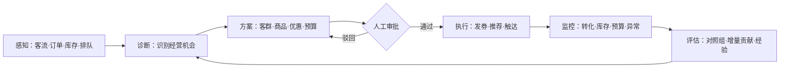
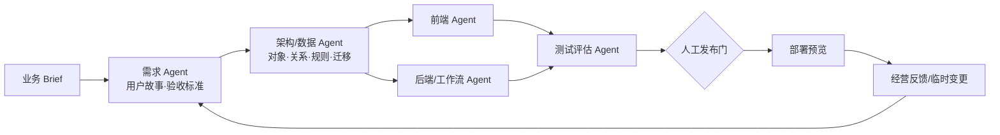

# 啤酒节活动：Loop 多 Agent 开发“啤酒节智能营促销系统”业务需求方案 V1

> 文档性质：活动演示与产品验证用业务需求方案，不代表国际啤酒节官方系统，也不构成经营效果或产品性能承诺。  
> 来源基础：[《啤酒节活动-贯穿场景设计-智能经营Agent.md》](../../啤酒节活动-贯穿场景设计-智能经营Agent.md)及当前 TiDB Starter、Drive9、Mem9、TiDB Cloud Lake 方案材料。  
> 核心目标：让参会者在同一段现场演示中，同时看到“Loop 如何更快交付和迭代软件”与“Agent 如何通过业务工作流改善经营结果”。

## 0. 审核结论：这次现场不应只做一个“会发券的网站”

建议把现场系统定义为：

> **一个面向大型节庆活动的智能增长运营系统：它根据实时客流、交易、库存和活动预算发现经营机会，由 Agent 生成促销方案，经人工审批后执行，再把结果反馈给下一轮经营和产品迭代。**

现场要证明的不是“AI 能生成几个页面”，而是两条完整闭环：

1. **产品开发闭环**：业务需求 → 多 Agent 分工开发 → 测试 → 发布 → 现场变更 → 再发布。
2. **智能经营闭环**：感知经营状态 → 识别问题 → 生成方案 → 人工审批 → 执行促销 → 评估结果 → 沉淀经验。

原场景中“领券、下单、推荐、复盘”仍然保留，但不再平均用力。现场唯一主事件建议收敛为：

> **晚高峰出现“热门区域排队、相邻区域客流不足、部分套餐库存积压”。系统能否把原本跨系统、跨角色的促销决策压缩到分钟级，生成并上线一个受预算、库存和人群资格约束的错峰组合券，并证明它带来了什么结果？**

这个事件有客流、有订单、有库存、有预算、有审批，也能自然产生一次临时产品变更，适合同时体现 Loop 和数据底座的价值。实际耗时以现场计时为准，不预先承诺固定分钟数。

---

## 1. 业务背景与事实边界

### 1.1 为什么是一个真实的经营问题

大型节庆不是单纯的“流量大”，而是大量客流、商户、商品、演出、路线和服务能力在短时间内不断变化。经营方既要提升消费，也要兼顾游客体验、商户协同、安全和预算。

可用于开场建立规模感的公开事实：

- 第 35 届国际啤酒节举办 30 天；2025 年主会场接待游客 697 万人次，消费啤酒 2900 余吨；分会场接待游客 78 万人次，销售啤酒 12.6 万余升，并举办 700 余场活动。（数据来源：政务网公开资料）
- 第 36 届国际啤酒节计划于 2026 年 7 月 17 日至 8 月 15 日举行；本方案编制时活动尚未收官，不使用 2026 年经营结果。（数据来源：政务网公开资料）

这些数字只说明场景规模，不意味着本演示系统服务于真实会场。

### 1.2 全场数字必须分成四类

| 标识 | 含义 | 使用方式 |
|---|---|---|
| 公开事实 | 已有公开来源支持 | 可用于活动规模和行业背景 |
| 演示假设 | 为演示构造的客流、订单、库存和结果 | 页面显著标注“模拟数据” |
| 现场实测 | Loop 本次运行实际产生的时间、任务、测试和变更记录 | 现场计时并保留 Trace |
| 规划目标 | 对未来 PoC 的目标，不是本次产品承诺 | 使用“目标”“待验证”措辞 |

不得把演示中的 GMV 提升、开发用时或 Agent 数量包装成真实客户结果。

---

## 2. 业务问题定义

### 2.1 当前经营方式的五个断点

| 断点 | 现场表现 | 业务后果 |
|---|---|---|
| 数据断点 | 客流、订单、库存、排队和活动预算分散在不同页面 | 运营看见结果时已错过窗口 |
| 决策断点 | 运营先导数、做表、开会，再决定发什么券 | 从发现问题到行动可能跨越数小时 |
| 执行断点 | 客群、优惠、库存、预算和消息投放分别配置 | 易发错券、超预算或促销无货商品 |
| 评估断点 | 只看到领取量和 GMV，看不到增量贡献 | 无法判断优惠是在创造需求还是让利给原有订单 |
| 研发断点 | 业务规则变化要重新提需求、排开发、测试和上线 | 活动只有 30 天，系统迭代速度跟不上经营变化 |

### 2.2 本系统要解决的核心问题

系统不是替运营人员自动决定一切，而是把一条原本分散的流程压缩成受控闭环：

### 2.3 三类可感知价值

| 价值 | 听众现场看到什么 | 衡量方式 |
|---|---|---|
| Loop 开发效率 | 多个 Agent 同时完成需求、数据、前后端、测试和发布；临时需求能继续迭代 | 首次可用版本耗时、变更交付耗时、并行任务数、人工介入次数 |
| 智能经营价值 | Agent 不是只生成文案，而是发现问题、计算方案、受控执行并关联结果 | 转化率、客单价、增量 GMV、活动贡献、库存消化和区域客流均衡 |
| 运营提效 | 原来跨多个角色和系统的流程变成一个可审批、可追踪的工作流 | 决策时延、配置步骤、审批时延、异常停止时延、复盘耗时 |

---

## 3. 目标用户与职责

| 角色 | 核心诉求 | 系统权限 |
|---|---|---|
| 活动经营负责人 | 看整体收入、体验、风险与预算 | 查看全局、审批大额活动、终止活动 |
| 营销运营 | 快速创建客群和活动，持续优化 | 创建草案、提交审批、查看效果 |
| 商户运营 | 提升本摊位销量，避免缺货或积压 | 维护商品库存、确认参与活动 |
| 现场服务人员 | 处理核销、退款、异常和游客咨询 | 核销、补偿、提交异常 |
| 财务/风控 | 防止超预算、重复优惠和错误客群 | 设置规则、审批、审计 |
| 产品/研发负责人 | 根据经营变化快速调整系统 | 在 Loop 中审批需求、代码和发布 |
| 游客 | 获得合适、清晰、可用的活动体验 | 查看推荐、领券、下单、核销 |

安全边界：不向未成年人推荐含酒精商品；涉及含酒精商品时必须经过年龄和资格校验；推荐文案不得鼓励过量饮酒。现场使用合成用户，不使用真实个人信息。

---

## 4. 贯穿全场的主事件

### 4.1 事件设定

演示时间来到 19:30，运营驾驶舱出现三个同时发生的信号：

- A 区热门摊位平均等候时间达到 22 分钟；
- B 区客流低于同时间段基线 35%；
- B 区“餐饮 + 文创”组合库存仍有 420 份，需要在两小时内改善周转；
- 当前营销预算还剩 6000 元，但不能对全体游客无差别打折。

以上均为演示假设。

### 4.2 Agent 给出的建议

Agent 生成“夜游错峰组合券”草案：

- 目标人群：已完成资格校验、进入会场 30 分钟以上、尚未下单、当前位于 A 区附近的成年游客；
- 推荐内容：B 区餐饮与文创组合，酒类只作为通过资格校验后的可选项；
- 优惠：满 88 减 12；
- 数量：首批最多 500 张；
- 预算上限：6000 元；
- 有效期：90 分钟；
- 库存约束：可售组合低于 80 份时自动暂停；
- 风险约束：退款率超过 3%、核销异常连续出现或预算达到上限时自动暂停；
- 评估方式：目标人群随机分为实验组和对照组，比较单位访客净支付 GMV，而不是只看领取量。

### 4.3 人工审批看到的内容

审批页不能只显示“是否同意”。它必须同时给出：

1. 为什么建议现在行动；
2. 使用了哪些客流、库存、订单和历史经验；
3. 预计触达多少人、最多花多少钱；
4. 哪些人不能触达；
5. 什么情况下自动停止；
6. 如何判断活动是否真正创造了增量。

### 4.4 执行与复盘

审批通过后，系统完成：

- 创建活动版本并冻结规则；
- 锁定活动预算和可售库存额度；
- 生成实验组与对照组；
- 向实验组发布优惠和 B 区路线建议；
- 记录领取、下单、核销、退款和预算变化；
- 触发自动暂停或人工接管；
- 活动结束后计算增量结果，并生成下一轮建议。

---

## 5. 两条必须同时演示的闭环

### 5.1 Loop 产品开发闭环

Loop 在现场承担的是“软件交付控制面”：拆解任务、并行协作、共享上下文、检查产物、保留变更、触发测试、等待人工确认并形成新版本。

### 5.2 智能经营工作流

Loop 生成的应用内嵌一条“经营行动工作流”：

`机会发现 → 方案草拟 → 风控校验 → 人工审批 → 发布执行 → 自动监控 → 暂停/调整 → 效果评估 → 经验候选`

两条闭环的区别必须讲清：

- **Loop 工作流改变软件**，把新需求变成一个新版本；
- **经营工作流改变业务状态**，把经营建议变成一次受控行动；
- 二者通过同一组业务对象和验收指标连接，但不能混成一张“万能 Agent”流程图。

---

## 6. 产品范围：现场到底开发什么

### 6.1 三个可见界面

#### A. 游客端 H5

- 活动首页与会场地图；
- 资格校验与会员登录（演示账号）；
- 个性化活动卡片；
- 领券、模拟下单和核销；
- 推荐理由和活动规则；
- 非酒精选项及负责任饮酒提示。

#### B. 运营驾驶舱

- 实时客流、订单、GMV、库存、排队和预算；
- 分区域/商户/客群的经营异常；
- Agent 促销建议与证据；
- 活动审批、发布、暂停和版本历史；
- 实验组/对照组效果；
- Agent 行动记录和错误解释。

#### C. Loop 开发工作台

- 业务需求与验收标准；
- 多 Agent 任务分解和负责人；
- 代码、Schema、工作流与测试结果；
- 人工评审点；
- 首次发布和第二次迭代的 Diff；
- 本次开发实际耗时与人工介入次数。

### 6.2 P0 / P1 / P2 范围

| 优先级 | 能力 | 现场要求 |
|---|---|---|
| P0 | 经营驾驶舱 | 必须可查看模拟客流、订单、库存和预算 |
| P0 | Agent 活动草案 | 必须生成客群、商品、优惠、预算、时间和停止条件 |
| P0 | 人工审批 | 未审批不能发布，审批后形成不可变活动版本 |
| P0 | 领券与模拟下单 | 必须验证资格、预算、库存和重复领取 |
| P0 | 自动暂停 | 至少演示一次库存或风险阈值触发 |
| P0 | 结果评估 | 必须比较实验组与对照组，并展示计算口径 |
| P0 | Loop 现场迭代 | 根据临时需求修改规则或页面并重新发布 |
| P0 | 全链审计 | 能沿 activity_id / workflow_id / trace_id 查到关键动作 |
| P1 | 个性化推荐 | 按位置、历史偏好和实时状态排序活动 |
| P1 | 记忆复用 | 召回品牌规则、禁用词和上次活动经验 |
| P1 | 活动 A/B 版本 | 同时比较两个优惠或规则版本 |
| P1 | 复盘报告 | 自动生成活动结果、异常和下一步建议 |
| P2 | 真实支付/CRM/POS | 不进入本次现场，使用模拟适配器 |
| P2 | 跨商户结算 | 只定义接口和数据对象，不现场开发 |
| P2 | 生产级推荐模型 | 使用透明规则或演示模型，不宣称生产精度 |

---

## 7. 详细业务需求与验收标准

### BR-01 经营态势识别

系统应按区域、时间、商户、商品和客群展示客流、转化、GMV、库存和排队状态，并能指出异常相对什么基线产生。

验收标准：

- 数据页显示事件时间和刷新时间；
- 任何“下降 35%”都能展开查看对比口径；
- 模拟数据与真实数据入口视觉区分；
- 经营建议必须引用至少一个实时指标和一个约束指标。

### BR-02 Agent 促销方案生成

运营可以用自然语言输入目标，例如：“在不超过 6000 元预算、不影响热门区库存的前提下，提升 B 区两小时内的消费。”

Agent 输出必须结构化为：目标、人群、商品、优惠、预算、有效期、资格条件、停止条件、评估方法和解释；不能只输出营销文案。

### BR-03 活动审批与发布

活动状态至少包含：`draft → pending_approval → approved → running → paused/completed/cancelled`。

验收标准：

- Draft 不可被游客领取；
- 高于预算阈值或涉及含酒精商品时进入人工审批；
- 审批记录包含人、时间、版本和意见；
- 发布后修改规则必须生成新版本，不覆盖历史版本。

### BR-04 资格、库存和预算一致性

领券/下单时必须在一个受控事务中完成资格校验、重复领取校验、预算占用和库存占用，避免超发、重复发放或卖出不可用商品。

验收标准：

- 同一用户对同一活动重复请求只产生一张有效券；
- 预算耗尽后新请求失败并给出明确原因；
- 库存低于阈值后活动暂停；
- 重试不产生重复订单或重复扣减。

### BR-05 实验与增量评估

系统应对符合条件的客群进行实验组/对照组分配，记录曝光、领取、下单、核销和退款。

验收标准：

- 分组规则可查看且在活动期间保持稳定；
- 页面同时展示转化率、单位访客净支付 GMV、客单价和优惠成本；
- 小样本只展示描述性结果，不宣称统计显著；
- 不允许只用领取量证明业务成功。

### BR-06 异常监控与人工接管

系统应监控预算、库存、退款、核销错误和工作流失败。达到阈值后自动暂停并通知运营；运营可查看原因后恢复或终止。

### BR-07 复盘与经验沉淀

活动结束后生成结构化复盘：目标是否完成、增量贡献、主要异常、失败步骤、有效人群和下一步建议。只有经规则或人工确认的结论才能写成长期经验。

### BR-08 Loop 需求变更

经营负责人临时提出：

> “把活动从单一满减扩展为‘家庭游客只能领取餐饮文创券，成年人通过资格校验后才展示含酒精可选项’，并在审批页增加客群资格说明。”

Loop 应完成需求影响分析、数据/接口/页面修改、回归测试和新版本发布。此变更同时验证产品迭代效率与业务安全性。

---

## 8. 多 Agent 开发分工

| Agent | 输入 | 交付物 | 人工检查点 |
|---|---|---|---|
| 需求 Agent | 业务 Brief、用户角色、经营目标 | 用户故事、P0 范围、验收标准、风险清单 | 产品负责人确认范围 |
| 业务规则 Agent | 预算、客群、商品、审批规则 | 状态机、资格规则、停止条件、补偿规则 | 运营/风控确认 |
| 数据架构 Agent | 业务对象与工作流 | ER 模型、索引、迁移、种子数据 | 架构负责人检查一致性 |
| 后端/工作流 Agent | 接口和状态机 | API、事务、幂等、审批与暂停流程 | 关键写入代码评审 |
| 前端 Agent | 用户故事与 API | 游客 H5、运营驾驶舱、审批页 | 业务负责人验收 |
| 测试评估 Agent | 验收标准和实现 | 单元/集成/业务场景测试、失败报告 | 未通过不得发布 |
| 发布 Agent | 已批准版本 | 构建、部署、版本和回滚点 | 人工发布门 |

多 Agent 演示的价值不在于同时显示很多头像，而在于：任务依赖清晰、产物能被下游使用、失败能回到责任 Agent、关键动作仍由人批准。

---

## 9. 工作流设计

### WF-01 活动创建与审批

1. 经营异常触发或运营主动输入目标；
2. Agent 查询实时业务状态和有效经验；
3. 生成结构化活动草案；
4. 规则引擎检查预算、库存、客群资格和敏感内容；
5. 高风险项进入人工审批；
6. 审批通过后冻结版本并发布；
7. 失败则保留原因并回到草案。

### WF-02 活动运行与自动暂停

1. 用户进入资格判断；
2. 系统分配实验组/对照组；
3. 发券时占用预算和券库存；
4. 下单时校验商品与活动版本；
5. 持续监控退款率、库存和预算；
6. 触发阈值后自动暂停；
7. 运营查看证据并恢复、修改或终止。

### WF-03 活动复盘与记忆候选

1. 汇总经营结果和 Agent Trace；
2. 计算实验/对照差异和活动贡献；
3. 定位异常工作流步骤；
4. 输出“事实、判断、建议”三段式复盘；
5. 形成 Memory Candidate；
6. 经确认后写入长期经验，供下一次活动召回。

### WF-04 产品迭代与发布

1. 业务负责人提交规则变更；
2. 需求 Agent 生成影响分析和验收标准；
3. 数据、后端和前端 Agent 并行修改；
4. 测试 Agent 执行旧场景回归和新场景验收；
5. 发布 Agent 生成版本与回滚点；
6. 人工确认后切换新版本；
7. Loop 记录从需求到发布的完整耗时和变更。

---

## 10. 业务对象与最小数据模型

### 10.1 核心对象

| 对象 | 关键字段 |
|---|---|
| visitor/member | visitor_id、年龄资格、会员层级、偏好引用、当前区域 |
| zone/merchant | zone_id、merchant_id、当前客流、排队时长、营业状态 |
| product/inventory | product_id、分类、价格、可售库存、风险标签 |
| campaign | campaign_id、目标、预算、客群、状态、当前版本 |
| campaign_version | 规则快照、审批状态、开始/结束时间、停止条件 |
| coupon | coupon_id、member_id、状态、过期时间、幂等键 |
| order | order_id、商品、净支付、优惠、状态、活动版本 |
| experiment_assignment | visitor_id、experiment_id、group、分配时间 |
| workflow_instance | workflow_id、当前节点、负责人、超时、错误 |
| approval | 审批人、版本、结论、理由、时间 |
| business_event | 客流、曝光、领取、下单、核销、退款和库存事件 |
| agent_task/trace | Agent、任务、工具、输入输出摘要、耗时、错误、版本 |
| memory_candidate | 建议经验、证据、置信度、审批状态、有效期 |

### 10.2 统一关联键

全链路至少使用：`tenant_id`、`campaign_id`、`campaign_version`、`workflow_id`、`visitor_id`、`order_id`、`agent_task_id` 和 `trace_id`。

这使系统可以回答：某个经营结论来自哪批数据、由哪个 Agent 建议、谁批准、执行了哪个版本、产生了哪些订单、为什么后来被暂停。

---

## 11. Loop 与四项数据能力如何嵌入场景

> 以下是目标架构映射，实际演示范围以活动环境中已验证的产品版本和接口为准。

| 层次 | 在本场景中的职责 | 现场最小证据 |
|---|---|---|
| Loop | 多 Agent 需求拆解、开发协作、评审、测试、发布和后续迭代 | 任务图、代码 Diff、测试结果、两个版本、实际耗时 |
| Drive9 | 保存代码、文件、Git 状态、构建产物、Checkpoint 和 Agent Handoff | 更换/恢复任务后仍可继续；能查看 Checkpoint 和交接产物 |
| TiDB Starter / TiDB X | 保存会员、活动、预算、库存、优惠券、订单和工作流状态，保证关键写入一致性 | 领券幂等、预算/库存事务、状态机和实时驾驶舱 |
| Mem9 | 召回品牌规范、禁用词、客群规则和经确认的历史经验 | 活动生成前召回来源；复盘后只写入经确认的经验候选 |
| TiDB Cloud Lake | 长期保存经营事件、Agent Trace、Eval 和实验结果，做跨活动归因 | 从 trace_id 还原一次决策；把活动结果与 Agent 版本关联 |

推荐现场“跑真”的层次：

- Loop：真实任务拆解、开发、测试和迭代；
- Starter：真实保存演示业务数据并执行事务；
- Drive9：真实保存工作现场并展示恢复/版本；
- Mem9：至少真实完成一次规则召回；
- Cloud Lake：使用预置历史事件集，同时追加本次现场 Trace，避免等待大量数据积累。

不应为了“四个产品都出现”而让所有环节阻塞主链路。经营交易路径以 Starter 为准，长期 Trace 分析异步进入 Lake，未经验证的分析结果不能自动成为 Mem9 的企业规则。

---

## 12. 量化模型：让听众看到价值，但不虚构 ROI

### 12.1 演示数据集

建议预置一套可重复播放的合成事件流：

- 10,000 个游客会话；
- 3 个区域、12 个商户、48 个商品；
- 3,200 个模拟会员；
- 600 笔历史订单；
- 90 分钟经营窗口压缩为 6 分钟播放；
- 1 个客流失衡事件、1 个库存阈值事件、1 个重复领券重试事件。

### 12.2 演示结果示例

以下数字只用于校验系统计算逻辑，页面必须标注“模拟结果，不代表真实经营提升”：

| 指标 | 对照组（1000 人） | 实验组（1000 人） | 差异 |
|---|---:|---:|---:|
| 下单转化率 | 4.0% | 6.5% | +2.5 个百分点 |
| 订单数 | 40 | 65 | +25 |
| 净支付客单价 | ¥88 | ¥96 | +¥8 |
| 净支付 GMV | ¥3,520 | ¥6,240 | +¥2,720 |
| 优惠成本 | ¥0 | ¥780 | +¥780 |

如演示假设商品综合毛利率为 45%，则可继续计算：

- 增量毛利：`¥2,720 × 45% = ¥1,224`；
- 扣除优惠后的增量贡献：`¥1,224 - ¥780 = ¥444`；
- 本活动示例贡献/优惠成本：`¥444 ÷ ¥780 ≈ 56.9%`。

这里的意义是展示系统会把收入、毛利、优惠和对照基线放在一起计算，而不是证明真实活动一定提升 56.9%。小样本不做统计显著性承诺，也不外推到数百万游客。

### 12.3 Loop 研发效率计分板

现场不要预先宣布“效率提升 10 倍”，而是实时记录：

| 指标 | 计算方式 |
|---|---|
| 首次交付时长 | 业务 Brief 确认到可访问预览环境 |
| 变更交付时长 | 变更确认到新版本通过验收 |
| 并行收益 | 各 Agent 任务耗时之和 ÷ 实际墙钟时间 |
| 人工介入次数 | 澄清、代码修复、测试修复、发布确认次数 |
| 首次验收通过率 | 首轮通过的 P0 验收项 ÷ P0 总项 |
| 回归可靠性 | 旧版通过且新版仍通过的测试数 ÷ 原测试数 |
| 恢复时间 | 从 Checkpoint 恢复到可继续开发的时间 |

会后再把同一需求交给传统流程或另一组工具做对照，才能形成有说服力的效率结论。

### 12.4 运营提效计分板

- 从异常出现到方案草案的时间；
- 从草案到审批完成的时间；
- 从审批到活动生效的时间；
- 原流程需要打开的系统数、导出的表格数和人工配置步骤；
- 超预算/低库存/高退款出现到自动暂停的时间；
- 活动结束到生成结构化复盘的时间。

---

## 13. 现场演示设计

### 13.1 推荐原则：基础骨架预置，业务能力现场生成

不建议在舞台上从空目录开始安装依赖、搭登录页或等待网络。那会把时间花在基础设施噪声上，也难以体现业务价值。

#### 预置且公开说明

- 设计系统、登录骨架和页面布局；
- 已连接的演示数据库与合成数据生成器；
- 构建/部署通道和演示账号；
- 支付、消息、地图、POS 的模拟适配器；
- 失败时可恢复的 Checkpoint。

#### 现场由 Loop 多 Agent 实际完成

- 业务需求和验收标准；
- 活动、活动版本、审批和实验数据模型；
- 促销建议结构与审批工作流；
- 领券幂等、预算/库存约束；
- 驾驶舱关键组件；
- 自动化业务测试；
- 临时资格规则变更和第二次发布。

#### 使用模拟但不伪装成真实

- 游客位置、客流、排队、订单和库存事件；
- 消息触达、支付和核销外部系统；
- 经营提升结果。

### 13.2 35 分钟完整版流程

| 时间 | 舞台动作 | 观众获得的体感 |
|---|---|---|
| 0–4 分钟 | 用公开规模数据和晚高峰事件提出问题 | 这是经营问题，不是网页生成比赛 |
| 4–7 分钟 | 在 Loop 输入 Brief，需求 Agent 生成范围与验收标准 | AI 先把模糊需求变成可验收任务 |
| 7–15 分钟 | 数据、前端、后端/工作流、测试 Agent 并行工作 | 多 Agent 有真实分工和依赖 |
| 15–18 分钟 | 人工查看测试、批准发布，打开游客端和驾驶舱 | 应用真实可运行、数据真实可写 |
| 18–25 分钟 | 播放晚高峰事件，Agent 建议活动，人工审批并执行 | Agent 从建议进入受控业务行动 |
| 25–29 分钟 | 触发库存阈值，活动自动暂停并追踪原因 | 系统有边界、能接管、可审计 |
| 29–33 分钟 | 提出资格规则变更，Loop 完成修改、回归和 V2 发布 | 上线不是终点，迭代速度同样可见 |
| 33–35 分钟 | 展示研发计分板、经营计分板和数据架构 | 效率和价值都落到可核对数字 |

如果现场只有 25 分钟，应把第一轮开发压缩为预先启动的任务，现场重点展示任务 Handoff、验收、经营闭环和第二轮真实迭代；不要删掉迭代环节。

### 13.3 现场必须始终可见的四个元素

1. 当前业务目标；
2. 当前 Loop 任务和负责人；
3. 当前应用版本与验收结果；
4. 当前业务结果与数据口径。

这样观众不会在多个终端、日志和页面之间迷失。

---

## 14. 非功能与治理要求

### 14.1 安全与权限

- 使用演示租户和合成用户；
- 密钥通过受控 Secret 引用，不写入代码、Prompt 或 Memory；
- 关键行动最小权限；
- 预算和含酒精商品活动必须经过审批；
- 操作记录可追溯到具体人、Agent、版本和工作流。

### 14.2 可靠性

- 发券和下单接口必须幂等；
- 预算、库存与券状态更新必须保持一致；
- Agent 或网络失败后工作流可重试或人工接管；
- 发布保留上一稳定版本和可恢复点；
- Cloud Lake 或 Mem9 不可用时，核心领券和订单路径仍能按降级规则运行。

### 14.3 可解释性

- 经营建议展示来源数据、规则、限制和不确定性；
- 人工审批看到的内容与实际发布版本一致；
- 复盘区分事实、模型判断和人工结论；
- 不显示无法核对的“AI 综合评分”。

### 14.4 演示可靠性

- 所有外部接口使用可控模拟器；
- 合成事件流固定随机种子，可重复播放；
- 预置最后一个稳定 Checkpoint 和录屏兜底；
- 现场网络中断时，可切换到本地数据与预构建依赖；
- 每个 Agent 设置最大运行时间，失败后允许降级到已生成产物继续主线。

---

## 15. 验收标准

### 15.1 业务闭环验收

- 能从一个经营异常生成结构化促销草案；
- 未经审批的活动不能触达用户；
- 审批后能完成领券、模拟下单和结果记录；
- 重复请求不会重复发券；
- 库存或风险阈值能自动暂停活动；
- 能比较实验组与对照组，并明确优惠成本和增量口径；
- 能沿统一 ID 还原建议、审批、执行、订单和复盘。

### 15.2 Loop 交付闭环验收

- 多 Agent 任务分解、依赖和交付物可见；
- 前后端、数据和测试产物能汇合成一个可运行版本；
- 关键发布经过人工门禁；
- 现场变更形成独立版本和清晰 Diff；
- 旧功能回归通过，新资格规则验收通过；
- 开发、变更、人工介入和恢复时间有真实记录。

### 15.3 观众理解度验收

会后用三个问题验证 Talk 是否成功：

1. 观众能否说清 Loop 除了生成代码，还如何完成协作、测试和持续迭代？
2. 观众能否说清 Agent 为什么不能直接发券，必须经过事实、规则、审批和审计？
3. 观众能否说清 Starter、Drive9、Mem9 和 Cloud Lake 分别保存什么长期资产？

---

## 16. 实施节奏

### 阶段 0：能力核验与冻结（T-14～T-10）

- 核验 Loop 当前版本可用的多 Agent、Workspace、Checkpoint、工具调用、测试和部署能力；
- 冻结现场网络、模型、数据库和演示终端；
- 确认哪些能力跑真、哪些预置、哪些模拟；
- 冻结 P0，不再增加大模块。

### 阶段 1：业务骨架与数据（T-10～T-7）

- 完成合成数据集、事件生成器和三个界面骨架；
- 完成业务对象、状态机和 API 契约；
- 建立稳定 Checkpoint。

### 阶段 2：Loop 多 Agent 编排（T-7～T-4）

- 固化需求 Agent、数据 Agent、前端 Agent、后端/工作流 Agent、测试 Agent 的输入输出；
- 为每个 Agent 设置超时、重试和降级产物；
- 验证第一次开发和第二次迭代都可重复。

### 阶段 3：全链路彩排（T-4～T-1）

- 至少进行 5 次完整彩排；
- 每次记录墙钟时间、失败位置、人工介入和恢复方式；
- 记录多次彩排的中位、最长演示时长和失败恢复时间，确保均能落在舞台窗口内；
- 准备网络、模型、部署和页面四类故障兜底。

### 阶段 4：现场与会后（T 日及 T+1）

- 现场保留完整任务、版本、测试和业务 Trace；
- 会后发布“实际计分板”，不使用预先写好的效率倍数；
- 将观众问题和失败点形成下一版需求，由 Loop 继续迭代，完成“演示后的真实闭环”。

---

## 17. 风险与取舍

| 风险 | 表现 | 处理方式 |
|---|---|---|
| 范围过大 | 会员、推荐、地图、支付、结算、客服全做 | P0 只围绕一次错峰促销闭环 |
| 现场等待 | Agent 安装依赖、生成过慢 | 基础骨架预置，业务模块现场生成 |
| 多 Agent 只是视觉效果 | 多个 Agent 重复写同一内容 | 明确输入输出、依赖、Handoff 和验收责任 |
| 只讲研发效率 | 观众看到代码，但不知道为什么值得开发 | 用经营事件、审批和增量结果串起系统 |
| 只讲 GMV | 促销可能只是让利或伤害体验 | 同时展示贡献、预算、库存、排队和退款 |
| 自动化越权 | Agent 直接发布或触达不合格人群 | 人工门禁、资格校验、预算和自动暂停 |
| 数字失真 | 把合成结果说成客户 ROI | 全程四类数字标识，结果页加醒目标注 |
| 强行集成所有产品 | 主链路复杂、任一组件失败即中断 | 分清交易主链与异步进化链，允许降级 |

---

## 18. 最终舞台表达

建议全场只保留一句总主张：

> **Loop 让企业更快地把经营想法变成软件；工作流和数据底座让这套软件敢于进入真实业务，并且每一次行动都可控制、可衡量、可继续迭代。**

三句收束：

- **快，不是十分钟生成一个页面，而是十分钟后仍然能够测试、发布和继续修改。**
- **智能，不是 Agent 会写促销文案，而是它能在事实、预算、库存和权限边界内完成一条经营闭环。**
- **价值，不是展示一个漂亮 Dashboard，而是开发时长、决策时延、增量贡献和风险停止都能被真实记录。**

这个版本将原来的“智能经营 Agent”从数据库能力故事，升级为一个可现场验收的产品开发与业务经营联合演示：近景有啤酒节体感，中景有 Loop 多 Agent 交付效率，远景则自然落到企业如何把 Agent 接入可治理、可迭代的业务流程。
